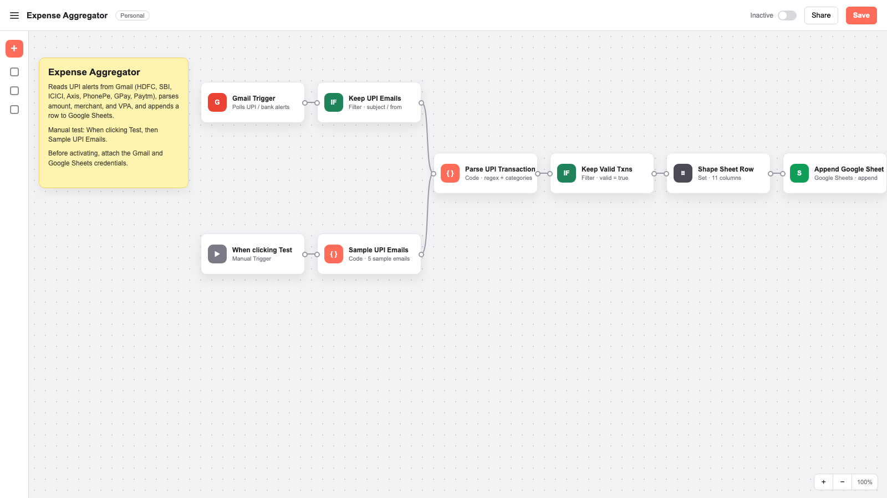

# Expense Aggregator

n8n workflow that reads UPI transaction emails and appends each one to a Google Sheet.

Related workflows:

- [UPI Spend Tracker](https://github.com/ARAVINDHRAJA123/UPI-Spend-Tracker) — HDFC UPI emails → Sheets + Telegram
- [n8n expense tracker template #7644](https://n8n.io/workflows/7644-automated-expense-tracking-from-emails-and-telegram-with-gemini-ai-and-google-sheets/) — bank / GPay / PhonePe / Paytm emails → Gemini → Sheets

This workflow parses the email with regex and appends a row. It runs on free n8n, without a Gemini API key.

```
Gmail UPI alert
        │
        ▼
Keep only bank / UPI mail
        │
        ▼
JavaScript parser extracts
  amount, merchant, VPA, debit/credit, category
        │
        ▼
Google Sheet gets a new row
```

## Files

| File | What it is |
| --- | --- |
| `n8n/expense-aggregator.json` | Import this into n8n |
| `n8n/code/parse-upi-transaction.js` | The parser used by the Code node |
| `src/parseUpiEmail.js` | Same parser, used by the tests |
| `sheets/Expense-Aggregator.template.csv` | Header + sample rows for Sheets |
| `assets/workflow.png` | Screenshot of the workflow |

Sheet columns:

`Date, Month, Amount, Type, Merchant, Category, App, VPA, UPI_Ref, Subject, MessageId`

## 1. Try the parser without n8n

```bash
npm test
npm run demo
```

`demo` prints a table of parsed sample emails (HDFC, PhonePe, GPay, Paytm, SBI, ICICI, Axis).

## 2. Import the workflow

1. Install n8n (`npx n8n` or n8n Cloud).
2. Open the editor → **⋯ → Import from File**.
3. Choose `n8n/expense-aggregator.json`.
4. You should see this canvas:



Two paths land on the same parser:

- **When clicking Test → Sample UPI Emails**: five sample emails
- **Gmail Trigger → Keep UPI Emails**: polls the inbox after the Gmail credential is attached

Then: **Parse UPI Transaction → Keep Valid Txns → Shape Sheet Row → Append Google Sheet**

## 3. Google Sheet

1. Create a sheet named **Expense Aggregator**.
2. Rename the first tab to **Transactions**.
3. Paste the header row from `sheets/Expense-Aggregator.template.csv`.
4. Copy the spreadsheet ID from the URL:
   `https://docs.google.com/spreadsheets/d/THIS_PART/edit`
5. In the **Append Google Sheet** node, replace `YOUR_GOOGLE_SHEET_ID`.
6. Connect a Google Sheets OAuth or service-account credential.

## 4. Gmail

Use the Gmail OAuth credential in n8n (easier than IMAP). The trigger already searches:

```
(UPI OR PhonePe OR "Google Pay" OR GPay OR Paytm OR "transaction alert" OR VPA OR "UPI Ref" OR debited OR credited) -category:promotions newer_than:7d
```

Turn on email alerts in your UPI app / bank if they are off.

## 5. Test the workflow

1. Open **When clicking Test** and click **Test workflow**.
2. Confirm the five sample rows show up on the Transactions tab.
3. Attach Gmail, activate the workflow.

## Parser coverage

Built from the HDFC copy documented in UPI Spend Tracker, PhonePe receipt wording, and common SBI / ICICI / Axis UPI alert lines:

| Source | Example the parser understands |
| --- | --- |
| HDFC debit | `Rs.249.00 has been debited ... to VPA swiggy@yesbank SWIGGY` |
| HDFC credit | `Rs.86.00 is successfully credited ... by VPA varun@okhdfcbank` |
| PhonePe | `Paid To IRCTC UTS ₹ 185` + `Txn. ID` |
| Google Pay | `You paid ₹350 to Uber India via UPI` |
| Paytm | `Paid ₹199 to Netflix via UPI` |
| SBI / ICICI / Axis | `UPI/ZOMATO/zomato@icici/...` |

Categories come from merchant keywords: Food, Travel, Shopping, Bills, Entertainment, Transfer, Money in.

If an alert does not match, add a regex in `src/parseUpiEmail.js`, then paste that change into the Code node or run `node scripts/build-workflow.js`.

## Safety

- Do not put your real Gmail password in n8n. Use Google OAuth or an App Password.
- The sheet stores merchant names and VPAs. Share it only with people who should see the transactions.
- The Gmail search excludes promotions. Keep Valid Txns skips a row when the amount is missing.
